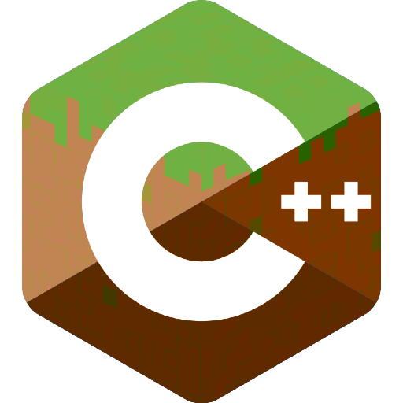

<h1>MineServer</h1>

A rewrite of the Java minecraft server (1.8.9) in C++ from scratch !

## Contents
- [Contents](#contents)
- [Goals](#goals)
- [Libraries](#libraries)

## Goals
The Mineserver project has simple goals : be fast, reliable and seemless (there should)
not be any difference from logging in a java minecraft server or the Mineserver project.

## Libraries
This project uses a few embedded libraries (included in the project) :
- [RapidJson](https://github.com/Tencent/rapidjson) one of the fastest json-parsing libs out there